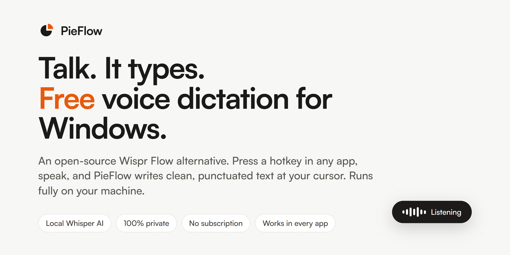
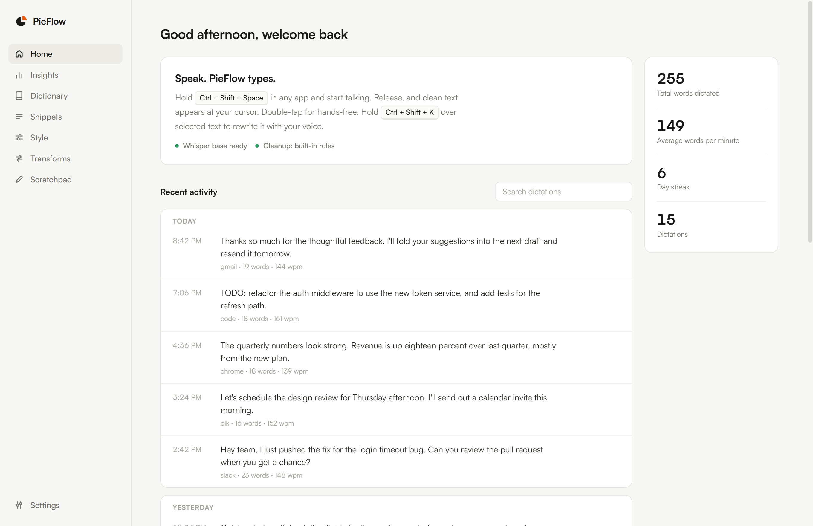
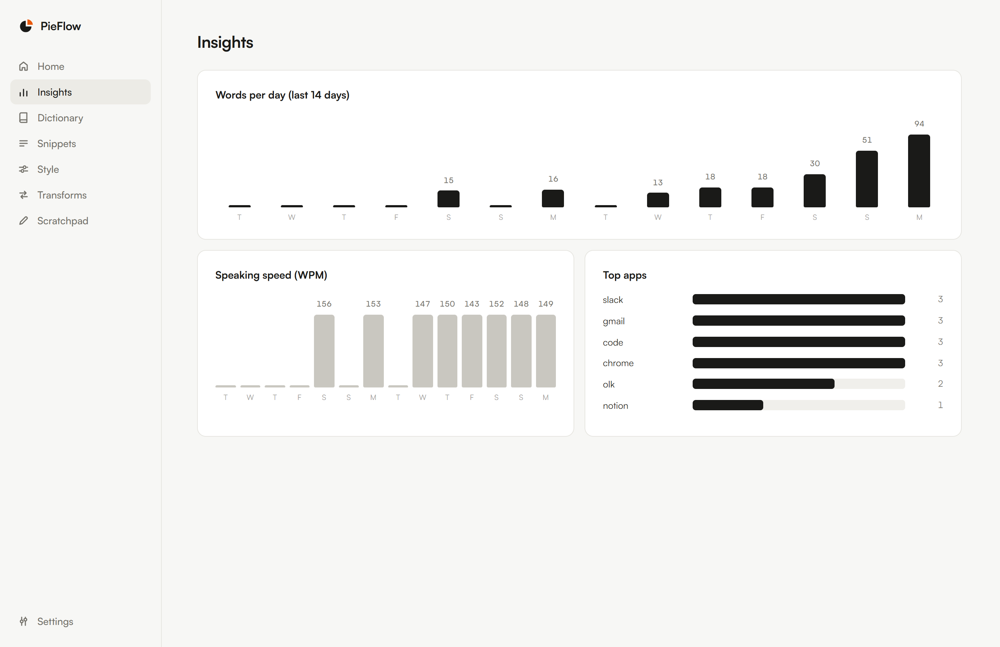

<p align="center">
  
</p>

<h1 align="center">PieFlow</h1>

<p align="center">
  <b>A free, open-source Wispr Flow alternative for Windows.</b><br>
  Press a hotkey in any app, speak, and PieFlow types clean, punctuated text at your cursor.<br>
  Local Whisper AI voice dictation that runs entirely on your machine. No account, no subscription, no cloud.
</p>

<p align="center">
  <a href="https://github.com/shivankoctupie/pieflow/releases/latest"></a>
  <a href="https://github.com/shivankoctupie/pieflow/releases"></a>
  <a href="LICENSE"></a>
  
  <a href="https://github.com/shivankoctupie/pieflow/stargazers"></a>
</p>

<p align="center">
  <a href="#download-windows">Download</a> ·
  <a href="#features">Features</a> ·
  <a href="#pieflow-vs-wispr-flow">vs Wispr Flow</a> ·
  <a href="#how-it-works">How it works</a> ·
  <a href="#pricing">Pricing</a> ·
  <a href="#faq">FAQ</a>
</p>

<p align="center">
  <i>Like PieFlow? <a href="https://github.com/sponsors/shivankoctupie">Sponsor the project</a> or grab <a href="#pricing">Pro</a> to support development.</i>
</p>

---

PieFlow is a system-wide **AI voice keyboard for Windows**. Hold a hotkey anywhere in Windows, speak naturally, and PieFlow transcribes your voice with a local Whisper model, cleans it up (removes "um" and "uh", fixes punctuation and capitalization, handles self-corrections like "let's meet Tuesday, wait no Friday"), and types the finished text straight into whatever app has focus: your browser, email, VS Code, Slack, Notion, any text field.

It is a **free and private alternative to paid dictation tools like Wispr Flow and SuperWhisper**. Everything runs on your own machine. Your voice never leaves your computer, there is no login, and there is no subscription.

<p align="center">
  
</p>

## Download (Windows)

1. Go to the [**Releases page**](https://github.com/shivankoctupie/pieflow/releases/latest) and download `PieFlow.Setup.x.x.x.exe`.
2. Run it. PieFlow installs to the Start menu and lives in your system tray.
3. On first launch it sets up a local speech engine and downloads the Whisper model automatically (one time). Watch the status on the Home screen.
4. Hold **Ctrl + Shift + Space**, speak, release. Your words appear wherever your cursor is.

> The installer is not code-signed yet, so Windows SmartScreen may show a "Windows protected your PC" notice on first run. Click **More info** then **Run anyway**. The full source is in this repo, and you can [build it yourself](#build-from-source) if you prefer.

Prefer to run from source? See [Build from source](#build-from-source).

## Features

- **Push-to-talk and hands-free.** Hold the hotkey to dictate, or double-tap to toggle hands-free mode.
- **Types into any app.** Works in browsers, email clients, editors, chat apps, terminals, anything with a text field.
- **AI cleanup.** Strips filler words, fixes punctuation and capitalization, formats lists, and resolves spoken self-corrections so the text reads like you wrote it.
- **100% local and private.** Local Whisper transcription by default. No account, no telemetry, no cloud round-trip. Your audio stays on your device.
- **Free forever.** No subscription, no word limits, no paywall. Optional API keys (OpenAI, Groq) can be added for faster transcription, but they are never required.
- **Personal dictionary.** Teach PieFlow names, jargon, and product terms so it always spells them right. It also learns from your corrections over time.
- **Snippets.** Say a trigger phrase like "insert signature" and PieFlow expands it into a saved block of text.
- **Command Mode.** Select text anywhere, hold a hotkey, and speak an instruction ("make this more concise", "turn into bullet points", "translate to Spanish"). PieFlow rewrites the selection in place.
- **Per-app tone.** Detects the app you are dictating into and adapts the style: professional for email, casual for chat, code-aware for editors.
- **100+ languages** with automatic language detection, powered by Whisper.
- **Usage insights.** Searchable history of everything you dictate, plus words per day, speaking speed, and a day streak.

<p align="center">
  
</p>

## PieFlow vs Wispr Flow

If you searched for a **Wispr Flow alternative for Windows**, here is how PieFlow compares. Wispr Flow is a polished commercial product; PieFlow is the free, open-source, local-first option.

| | **PieFlow** | Wispr Flow / typical cloud dictation |
|---|---|---|
| Price | Free and open source (MIT) | Paid subscription |
| Where speech is processed | On your machine (local Whisper) | In the cloud, on their servers |
| Privacy | Audio never leaves your device | Audio uploaded for processing |
| Account required | No | Yes |
| Works offline | Yes (local engine) | No |
| Windows support | Yes, built for Windows 10 and 11 | Yes |
| Source code | Fully open, auditable | Proprietary |
| AI cleanup of speech | Yes (rules built in, optional local LLM) | Yes |
| Command Mode (rewrite selected text) | Yes | Varies |
| Custom dictionary and snippets | Yes | Varies |

*This table reflects the general positioning of each tool. Check each product for its current features and pricing.*

The tradeoff is honest: a paid cloud service can lean on large server-side models, while PieFlow runs on your own hardware. For most everyday dictation the local "base" Whisper model is fast and accurate, and you can switch to a larger local model or add a Groq/OpenAI key if you want more speed or accuracy, without giving up the free local default.

## How it works

<p align="center">
  
</p>

1. **You press the hotkey.** A small overlay appears near the bottom of your screen showing that PieFlow is listening.
2. **You speak.** Audio is captured from your microphone locally.
3. **Whisper transcribes** the audio on your machine (or via your own API key if you added one).
4. **The cleanup layer** removes fillers, fixes punctuation, resolves self-corrections, applies your dictionary and the tone for the current app.
5. **PieFlow types the result** at your cursor, exactly where you were working. Say "press enter" to submit.

Say **"new line"** or **"new paragraph"** for line breaks, or a snippet trigger to expand saved text. Everything (history, dictionary, snippets, settings) is stored locally in SQLite and plain files.

## Usage

| Action | How |
|---|---|
| Dictate | Hold `Ctrl + Shift + Space`, speak, release |
| Hands-free dictation | Double-tap `Ctrl + Shift + Space`; press again to stop |
| Submit after typing | End your sentence with "press enter" |
| New line / paragraph | Say "new line" or "new paragraph" |
| Expand a snippet | Say the trigger phrase, e.g. "insert signature" |
| Command Mode | Select text, hold `Ctrl + Shift + K`, speak an instruction |

Both hotkeys are configurable in Settings.

## Build from source

Requirements: Node.js 18+ and (for the free local speech engine) Python 3.9+ on your PATH.

```bash
git clone https://github.com/shivankoctupie/pieflow.git
cd pieflow
npm install
npm start
```

To build the Windows installer yourself:

```bash
npm run dist
# output: dist/PieFlow Setup x.x.x.exe
```

On first run PieFlow creates a local Python environment, installs faster-whisper, and downloads the Whisper "base" model. If Python is missing, PieFlow tells you and you can either install it from python.org or add a cloud API key in Settings.

## Free vs. optional API keys

PieFlow is fully functional with **no keys**: local Whisper for speech, built-in rules for cleanup. Two optional upgrades, both off by default:

- **Ollama** (free, local): if Ollama is running, PieFlow uses it for smarter cleanup and Command Mode. Small fast models like `qwen3:1.7b` feel best for inline cleanup.
- **API keys** (paid, cloud): add an OpenAI or Groq key in Settings for faster transcription and higher-quality cleanup. Groq has a generous free tier. Keys are stored only on your computer and used directly against the provider. If a key stops working, PieFlow falls back to local automatically.

Priority when several options exist: your explicit setting first, then a cloud key, then Ollama, then built-in rules. Nothing ever breaks by removing a key.

## Pricing

PieFlow is **open source and free**. The core app, local dictation, cleanup, dictionary, snippets, and history are yours at no cost, forever.

**PieFlow Pro** ($29 one-time) is an optional supporter license that unlocks the power features and funds development:

| Free | Pro |
|---|---|
| Unlimited local dictation | Everything in Free |
| Local Whisper or your own key | Command Mode (rewrite selected text by voice) |
| AI cleanup & self-corrections | Custom transforms |
| Dictionary, snippets, history | Per-app style profiles |
| 100+ languages | Priority support |

Because PieFlow is open source, Pro runs on trust. Your license unlocks the Pro features in Settings and helps keep the project alive. Get it from the [website](https://pieflow.app/#pricing), or [sponsor the project](https://github.com/sponsors/shivankoctupie) if you prefer.

## Windows permissions

- **Microphone**: Settings > Privacy and security > Microphone > "Let desktop apps access your microphone" must be on.
- **Admin windows**: text cannot be injected into elevated apps (an elevated terminal, regedit) unless you run PieFlow elevated too. This is a Windows security rule (UIPI), not a bug.
- No accessibility permissions are required. The global hotkey and typing work out of the box on Windows.

## Troubleshooting

- **Nothing gets typed:** make sure the target window is not running as admin. Try Settings > Typing > "Always paste".
- **Poor transcription:** add the words to your Dictionary, switch the Local model to "small" in Settings, or add a free Groq key.
- **"No speech detected":** check the Windows microphone privacy toggle and the input device in Settings. The last recording is saved at `%APPDATA%\PieFlow\last-capture.wav` so you can hear what PieFlow heard.
- **Command Mode says it needs an LLM:** start Ollama (`ollama serve` with a model pulled) or add an API key.
- **Local engine stuck on setup:** install Python 3.9+ from python.org (check "Add python.exe to PATH"), then restart PieFlow.

## FAQ

**Is there a free Wispr Flow alternative for Windows?**
Yes, that is exactly what PieFlow is. It is free, open source, and runs locally on Windows 10 and 11.

**Does PieFlow work offline?**
Yes. With the default local Whisper engine, dictation works with no internet connection after the one-time model download.

**Is my voice data private?**
Yes. By default your audio is transcribed on your own machine and never uploaded. There is no account and no telemetry. If you choose to add a cloud API key, only then is audio sent to that provider, and only when you use that engine.

**Do I need a subscription or API key?**
No. PieFlow is free with no word limits. API keys are optional and only add speed or extra polish.

**What languages does it support?**
Over 100, via Whisper, with automatic language detection. Set a fixed language in Settings or leave it on "auto".

**How accurate is it?**
The default "base" model is fast and good for everyday use. Switch to "small", "medium", or "large-v3" in Settings for higher accuracy, or add a Groq/OpenAI key for cloud-grade transcription.

**Can I use it for coding?**
Yes. PieFlow detects code editors and preserves technical terms and casing. Command Mode can also reshape selected text on request.

**Is this a SuperWhisper or Talon alternative too?**
If you want free, local, open-source voice dictation on Windows, PieFlow covers the same core need as SuperWhisper (Mac) and overlaps with dictation setups people build with Talon. PieFlow focuses on being simple and working in every app out of the box.

**Why "PieFlow"?**
It is an original, clean-room open-source project inspired by the idea of a voice keyboard. It is not affiliated with Wispr Flow or any other product.

## Contributing

Issues and pull requests are welcome. Bug reports, new tone/style profiles, language fixes, and packaging improvements are all useful. If you build something on top of PieFlow, open an issue and tell us. See [DECISIONS.md](DECISIONS.md) for the architecture and why each part is built the way it is.

## Star this project

If PieFlow saves you some typing, please **star the repo**. It genuinely helps other people find a free, private dictation tool for Windows.

## License

[MIT](LICENSE). Free to use, modify, and distribute.

---

<p align="center">
  Built as an open-source, local-first take on the AI voice keyboard.<br>
  <b>PieFlow</b> · free voice dictation for Windows
</p>
